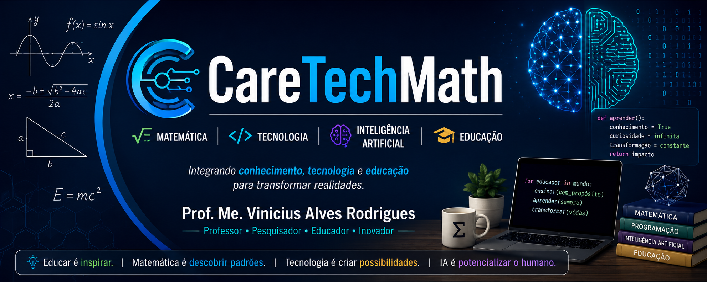

  

  <b>Professor • Pesquisador • Matemática • Computação • Inteligência Artificial • Educação</b>

  Matemática como formação. Tecnologia como ferramenta. Educação como propósito.

---

## 👋 Olá! Bem-vindo ao CareTechMath

Sou **Vinicius Alves Rodrigues**, professor, pesquisador, matemático e engenheiro de computação.

Minha trajetória profissional e acadêmica está na interseção entre **Matemática, Educação e Tecnologia**, com especial interesse no uso da **Inteligência Artificial, programação, modelagem e tecnologias digitais aplicadas ao ensino**.

Atualmente sou **doutorando em Ensino de Ciências e Matemática pela Universidade Cruzeiro do Sul**, onde desenvolvo pesquisas relacionadas ao uso crítico e pedagógico da Inteligência Artificial no Ensino de Matemática e Ciências.

O **CareTechMath** nasceu como um espaço para reunir e compartilhar:

* 📚 materiais utilizados em minhas aulas;
* 💻 códigos e exemplos de programação;
* 🤖 experimentações com Inteligência Artificial;
* 📐 projetos envolvendo Matemática e Tecnologia;
* 🔬 pesquisas e produções acadêmicas;
* 🧪 projetos educacionais e atividades investigativas;
* 🚀 experiências e aprendizados em tecnologia.

---

# 🎓 Formação Acadêmica

🎓 **Doutorando em Ensino de Ciências e Matemática**
Universidade Cruzeiro do Sul — UNICSUL

📊 **Mestre em Ciências — Ensino de Matemática**
Instituto de Matemática e Estatística da Universidade de São Paulo — IME-USP

🤖 **Especialista em Robótica**
Universidade Federal de Viçosa — UFV

💻 **Bacharel em Engenharia de Computação**
Universidade Virtual do Estado de São Paulo — UNIVESP

📐 **Licenciado em Matemática**
Universidade de São Paulo — USP

🎓 **Licenciado em Pedagogia**
Centro Universitário Internacional — UNINTER

♿ **Especialista em Educação Especial e Inclusiva**
Centro Universitário Internacional — UNINTER

🔌 **Técnico em Eletroeletrônica**
Escola Técnica de São Paulo — ETESP

---

# 👨‍🏫 Atuação

Minha experiência docente iniciou-se ainda durante minha formação no **IME-USP**, por meio de monitorias, projetos de iniciação científica e atividades relacionadas à formação de professores.

Ao longo da minha trajetória, passei a atuar na **Educação Básica, Educação Profissional e Tecnológica e Ensino Superior**, desenvolvendo atividades nas áreas de:

* 📐 Matemática e Estatística;
* ⚡ Física;
* 🤖 Inteligência Artificial;
* 💾 Banco de Dados;
* 💻 Programação e Pensamento Computacional;
* 🌐 Desenvolvimento Web;
* 🤖 Robótica Educacional;
* 📱 Desenvolvimento de Aplicativos;
* 💰 Educação Financeira;
* 🚀 Empreendedorismo;
* 🎓 Formação de professores.

Atualmente, também atuo como docente no **Ensino Superior**, ministrando componentes curriculares relacionados à Computação e Tecnologia.

---

# 🔬 Pesquisa

Minha pesquisa está concentrada nas relações entre:

**Inteligência Artificial + Matemática + Ciências + Educação**

Tenho especial interesse em investigar como tecnologias baseadas em Inteligência Artificial podem atuar como **ferramentas mediadoras em processos de aprendizagem**, especialmente em atividades envolvendo:

* 🤖 Inteligência Artificial aplicada à Educação;
* 📐 Ensino de Matemática;
* ⚡ Ensino de Física;
* 📊 Modelagem Matemática;
* 🔎 Investigação Matemática;
* 🌎 Educação CTS — Ciência, Tecnologia e Sociedade;
* 🧠 Pensamento crítico;
* 💻 Tecnologias Digitais;
* 🎓 Formação docente.

A tecnologia, nessa perspectiva, não substitui a mediação docente ou o protagonismo do estudante, mas pode ampliar possibilidades de **investigação, experimentação, análise e construção do conhecimento**.

---

# 📚 Publicações e Trabalhos Selecionados

Nesta seção estão reunidas algumas das minhas produções acadêmicas relacionadas à **Inteligência Artificial, Educação, Ensino de Matemática e Ciências e Tecnologias Digitais**.

### 🤖 Inteligência Artificial e Educação 5.0

**Inteligência Artificial e Educação 5.0: explorando limites da IA em problemas lógicos com aplicação educacional**

V. A. Rodrigues • M. A. S. Anastácio • M. S. T. Araújo • M. R. Voelzke  
📅 2025 • 📖 Revista de Estudos Interdisciplinares

---

### 🔬 Produção Científica e Inteligência Artificial

**Produção científica com o uso de IA: desafios e possibilidades**

V. A. Rodrigues • M. A. S. Anastácio • M. S. T. Araújo  
📅 2025 • 📚 III Simpósio em Ensino de Ciências e Matemática — SECIMAT

---

### ⚡ Inteligência Artificial, Matemática e Física

**Inteligência Artificial e o ensino de movimentos periódicos: uma abordagem interdisciplinar**

V. A. Rodrigues • M. A. S. Anastácio • M. S. T. Araújo • M. R. Voelzke  
📅 2025 • 🎓 X Simpósio Internacional de Tecnologias Digitais na Educação

---

### 🔭 Fenômenos Periódicos e Educação Científica

**Fenômenos periódicos no cotidiano: uma proposta interdisciplinar mediada por Inteligência Artificial na Educação Científica**

V. A. Rodrigues • M. A. S. Anastácio • M. S. T. Araújo • M. R. Voelzke  
📅 2026 • 📖 *Integrando saberes: pesquisas e reflexões no Ensino de Ciências* — Pimenta Cultural

---

### 🤖 Inteligência Artificial na Educação Científica

**Potencialidades e riscos da utilização da Inteligência Artificial na Educação Científica: perspectivas segundo discentes de um curso técnico**

V. A. Rodrigues • M. S. T. Araújo • M. A. S. Anastácio • A. C. Silva  
📅 2024 • 📖 *Ensino de Ciências e Matemática: ações e desafios* — Pimenta Cultural

---

### 🎓 Inteligência Artificial e Formação Docente

**Inteligência Artificial e a formação docente: concepções e crenças sob uma perspectiva qualitativa**

V. A. Rodrigues • E. M. Duarte  
📅 2024 • 📚 II Simpósio em Ensino de Ciências e Matemática — SECIMAT

---

### 📊 Estatística e Educação Matemática

**Uma experiência de inferência estatística informal na escola básica**

V. A. Rodrigues  
🎓 Dissertação de Mestrado • IME-USP • 2016

---

📚 **Para consultar minha produção acadêmica completa, acesse meu Currículo Lattes:**

---

# 📰 Divulgação Científica, Mídia e Formação

Além da produção acadêmica, procuro contribuir com a divulgação e a discussão sobre **Educação, Matemática, Tecnologia e Inteligência Artificial**, aproximando a pesquisa científica da prática educacional e da sociedade.

### 🎙️ Entrevista — R7 / Radar Tecnológico

**A IA não vai roubar seu emprego — mas alguém que usa IA vai**

Participação como entrevistado em matéria do **R7 / Radar Tecnológico**, discutindo os impactos da Inteligência Artificial no trabalho e sua utilização na rotina profissional, acadêmica e educacional.

Na entrevista, compartilho experiências relacionadas ao uso do ChatGPT como **mediador cognitivo**, auxiliando na organização de ideias, estruturação de conteúdos acadêmicos, elaboração de atividades, análises e propostas pedagógicas.

📅 Maio de 2026

---

### 🎓 Formação de Educadores e Inteligência Artificial

**Desbravando Fronteiras na Educação: Potencializando a Rotina do Professor com a Inteligência Artificial**

Minicurso voltado à utilização da **Inteligência Artificial na prática docente**, explorando possibilidades de integração dessas ferramentas à rotina do professor e aos processos educacionais.

🎤 Ministrante: **Vinicius Alves Rodrigues**  
📚 II Congresso Nacional de Licenciaturas e Pesquisas Acadêmicas — II CONLINPS  
📅 Janeiro de 2025

---

> 💡 **Pesquisa, formação e divulgação científica fazem parte de um mesmo propósito: transformar conhecimento em possibilidades de aprendizagem.**

---

# 💻 Tecnologias e Ferramentas

### 👨‍💻 Programação e Desenvolvimento

### 🤖 Inteligência Artificial

### 📊 Matemática, Dados e Pesquisa

### 🔧 Maker, Robótica e Computação Física

> 🚧 Tecnologia também é aprendizado contínuo. Esta seção será atualizada conforme novas ferramentas forem incorporadas aos meus projetos, pesquisas e atividades docentes.
---

# 📚 Ensino e Materiais

Este GitHub também funciona como um espaço de apoio às minhas disciplinas.

Os repositórios serão progressivamente organizados com **materiais, códigos, exercícios, exemplos e projetos**.

### 💻 Computação e Tecnologia

* 🧠 **Algoritmos e Pensamento Computacional**
* 🌐 **Desenvolvimento Front-End para Web**
* 🎨 **Design Profissional**
* 🤖 **Inteligência Artificial**
* 💾 **Banco de Dados**
* 📱 **Desenvolvimento de Aplicativos**
* 🤖 **Programação e Robótica**

### 📐 Matemática e Ciências

* 📐 **Matemática**
* 📊 **Estatística**
* ⚡ **Física**
* 💰 **Educação Financeira**

---

# 🏆 Reconhecimentos

🏅 **Menção Honrosa — Licenciatura em Matemática**
IME-USP

👨‍🏫 **Professor Homenageado**
Ensino Médio — Colégio Liceu Carvalho Pinto

👨‍🏫 **Professor Homenageado**
Técnico em Edificações — ETEC Mandaqui

🎓 **Professor Paraninfo**
Ensino Médio e Técnico em Edificações — ETEC Mandaqui

---

# 🚀 O que é o CareTechMath?

O **CareTechMath** representa a integração entre três elementos presentes na minha trajetória profissional e pessoal:

### 👨‍🏫 Care

Uma referência à identidade construída ao longo dos anos com meus alunos e à proximidade que considero fundamental no processo educativo.

### 💻 Tech

Tecnologia, Computação, Programação, Inteligência Artificial, Robótica e inovação.

### 📐 Math

A Matemática como base da minha formação acadêmica, profissional e da maneira como compreendo e investigo problemas.

---

### 📐 + 💻 + 🤖 + 🎓

### Matemática como formação. Tecnologia como ferramenta. Educação como propósito.

**Aprender • Experimentar • Investigar • Compartilhar**

---

# 🌐 Onde me encontrar

---

  ⭐ <b>CareTechMath</b> está em constante construção. 
  Na Matemática, na Tecnologia e na Educação, aprender também faz parte do processo.

